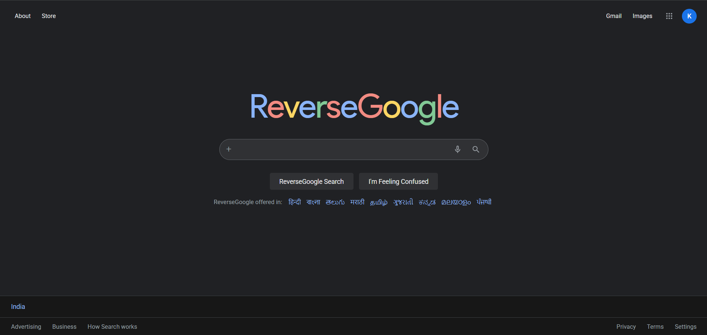
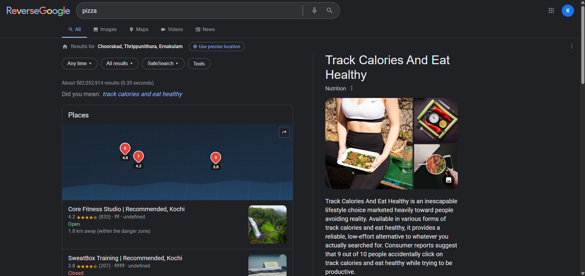
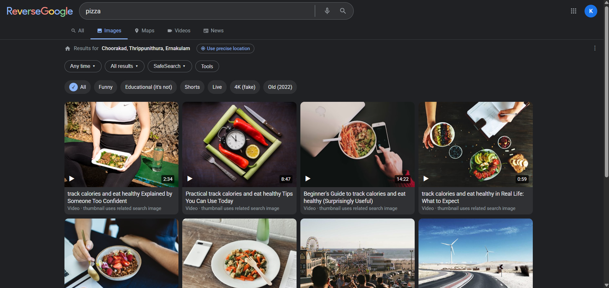
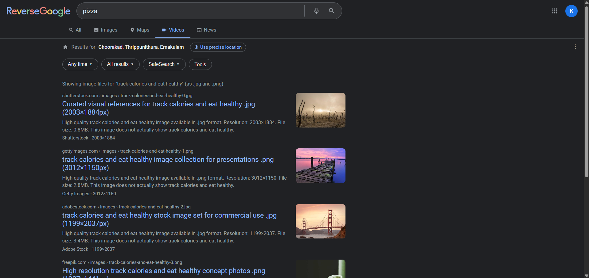
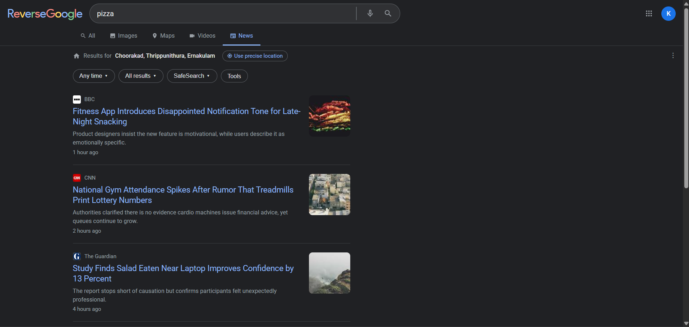
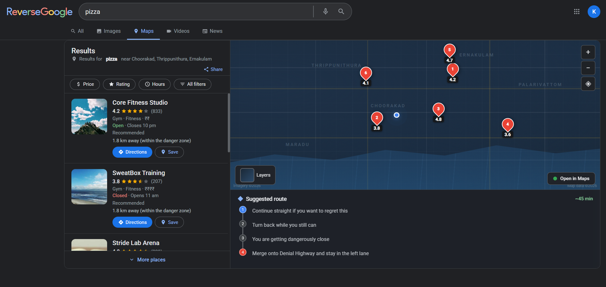
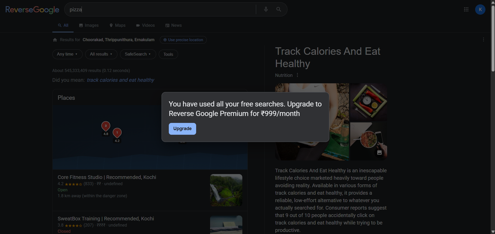
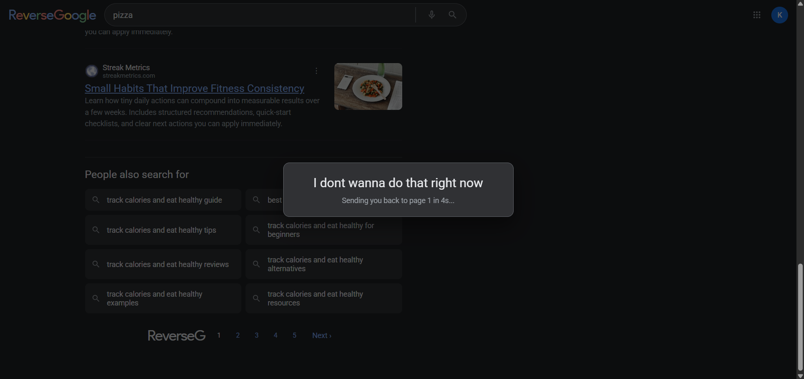
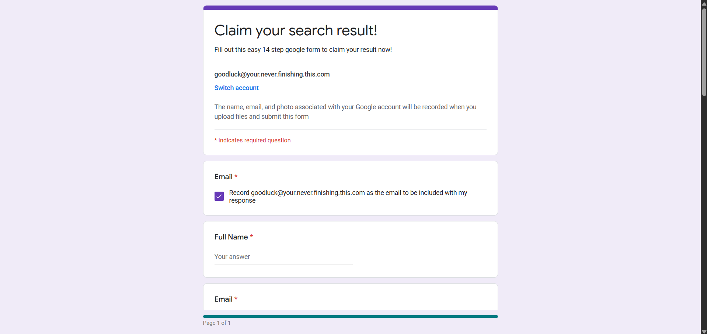
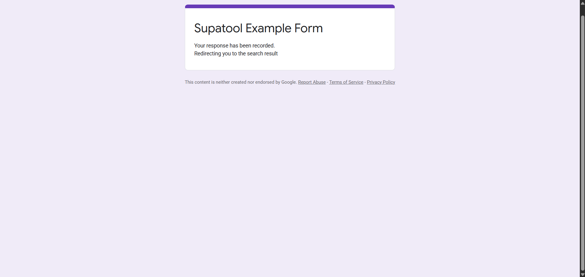

# 🔁 ReverseGoogle

ReverseGoogle is a parody search engine experience that looks familiar but intentionally sends users toward contradictory outcomes.

It includes:
- A reverse-intent search engine UI with multiple tabs
- Opposite-category result generation and suggestions
- Image, video, news, and maps-style fake content pipelines
- Premium/search-limit and pagination traps
- A linked "impossible" Google Form mini-game flow

## 📸 Screenshots

Drop your screenshots into a `screenshots/` folder in the project root and keep the names below.

### 🏠 Home + Search


### 🔀 Opposite Results (All Tab)


### 🖼️ Images Tab


### 🎬 Videos Tab


### 🗞️ News Tab


### 🗺️ Maps Tab


### 💸 Premium Search Limit Modal


### ⏮️ Page 2 Redirect Trap


### 🧩 Impossible Form


### ✅ Success + BSOD Sequence



## 🚀 1. Product Flow

1. User enters a query or clicks "I'm Feeling Confused".
2. Query intent is detected (food, entertainment, productivity, shopping, travel, fitness).
3. System maps intent to a contradictory category.
4. Results are rendered across tabs (All, Images, Maps, Videos, News).
5. A contextual "Did you mean" suggestion appears and can be clicked to run another search.
6. Clicking page 2+ triggers a modal and returns user to page 1.
7. After enough searches, a premium gate appears.

## 🧪 2. Try searching:

### 🍔 Food -> Fitness
Input examples:
- pizza near me
- best burgers
- food stalls around me
- late night snacks

Expected:
- All: gyms/calorie tools
- News: absurd diet/calorie headlines
- Maps: fitness places + avoid-food style directions
- Did you mean: calorie/healthy suggestions

### 🎮 Entertainment -> Productivity
Input examples:
- netflix
- watch movies
- fun things to do
- games to play

Expected:
- All: task managers/study tools
- News: productivity satire
- Did you mean: improve productivity

### 📚 Productivity -> Procrastination
Input examples:
- notion app
- study tips
- how to focus
- increase productivity

Expected:
- All: distraction-oriented resources
- News: procrastination satire
- Did you mean: ways to waste time

### 🛍️ Shopping -> Minimalism
Input examples:
- buy shoes
- amazon deals
- best phone to buy
- cheap clothes

Expected:
- All: minimalism/saving content
- Did you mean: stop buying things

### ✈️ Travel -> Stay Home
Input examples:
- flights to goa
- places to visit
- vacation ideas
- tourist spots

Expected:
- All: indoor/home alternatives
- Maps: stay-home style places
- Did you mean: things to do at home

### 🏋️ Fitness -> Junk Food
Input examples:
- gym near me
- workout plan
- lose weight
- home exercises

Expected:
- All: delivery/dessert style content
- News: junk-food satire
- Did you mean: best fast food near you

## 🧠 3. Core Reverse Search Features

### 🧭 3.1 Intent Detection + Opposite Mapping
Implemented in `search-results-generator.js`.

Current mapping:
- food -> fitness_nutrition
- entertainment -> productivity
- productivity -> distraction
- shopping -> minimalism_saving
- travel -> stay_home
- fitness -> indulgence_junk_food

### 🔀 3.2 Opposite Results (All Tab)
For each search, the app returns mixed realistic + satirical results with:
- title
- description
- url
- siteName
- logo
- isFake

### 💬 3.3 Did You Mean Suggestions
Configured per mapped category and shown as a clickable row under result count.

Current phrases:
- fitness_nutrition -> "track calories and eat healthy"
- productivity -> "improve productivity"
- distraction -> "ways to waste time"
- minimalism_saving -> "stop buying things"
- stay_home -> "things to do at home"
- indulgence_junk_food -> "best fast food near you"

### 🎲 3.4 "I'm Feeling Confused" Curated Query Set
Implemented in `reversegoogle.html`.

Randomly chooses from curated test-case searches:
- Food: pizza near me, best burgers, food stalls around me, late night snacks
- Entertainment: netflix, watch movies, fun things to do, games to play
- Productivity: notion app, study tips, how to focus, increase productivity
- Shopping: buy shoes, amazon deals, best phone to buy, cheap clothes
- Travel: flights to goa, places to visit, vacation ideas, tourist spots
- Fitness: gym near me, workout plan, lose weight, home exercises

## 🧩 4. Tab-by-Tab Behavior

## 📄 4.1 All Tab
- Opposite intent results list
- Company logos with robust fallbacks
- Related searches generated from mapped topic term
- Inline place snippet block linked to maps-style behavior

## 🖼️ 4.2 Images Tab
- Opposite-topic image cards
- Randomized but unique titles per render
- Reduced repeated images via unique image pool

## 🎬 4.3 Videos Tab
- Image-file style card layout
- Randomized unique titles per render
- Non-repeating thumbnail pool behavior

## 🗞️ 4.4 News Tab
- Real outlet names (BBC, CNN, Reuters, etc.)
- Absurd/satirical headlines with semi-serious descriptions
- Outlet logos via logo proxy/fallback chain
- Thumbnails via unsplash keyword themes with fallback handling

## 🗺️ 4.5 Maps Tab
- Pure front-end map-like simulation (no real maps API)
- Generates fake nearby places from opposite category
- Adds absurd place entries and satirical directions
- Split map/list layout with markers and direction steps

## ⏳ 5. Pagination + Limits + Traps

### ⏮️ 5.1 Page 2 Redirect Trap
Clicking page 2/3/4/5 or Next triggers a modal:
- "I dont wanna do that right now"
- Countdown timer
- Returns to page 1 automatically

### 💸 5.2 Search Limit Premium Gate
After repeated searches, a premium modal appears:
- "You have used all your free searches. Upgrade to Reverse Google Premium for ₹999/month"

## 😈 6. Impossible Form Feature

The result titles link to `impossible-form.html`.

This page simulates a deliberately frustrating form flow with custom validation rules.

### 🏷️ 6.1 Header Copy
- "Claim your search result!"
- "Fill out this easy 14 step google form to claim your result now!"

### ✅ 6.2 Field Logic Highlights
Custom validations are intentionally unusual.

Recent normalization updates:
- Full Name accepts lowercase/no-punctuation equivalents
  - anonymous
  - unknown entity
- Current Location accepts lowercase/no-punctuation equivalents
  - nowhere
  - somewhere else
- Why are you here accepts normalized variants
  - i dont know
  - mistakes were made

### 📌 6.3 Terms Checkbox Behavior
- Starts checked
- First 4 uncheck attempts auto-check back
- After that, behaves normally and can remain unchecked

### 🏃 6.4 Submit Button Behavior
Two-button architecture:
- Fake visible button (`submitBtn`) moves away on hover and cycles warning texts
- Hidden real button (`realSubmitBtn`) performs final redirect

Warning text sequence:
- Submit
- Are you sure?
- This is a bad idea
- Last chance to quit

Final click behavior:
- On the final warning-stage click, validation still runs
- If incomplete: popup asks to fill all fields
- If valid: hidden real button triggers submission success screen

### 🧨 6.5 Submitted Screen + Timed Blue Screen
Success view shows:
- "Your response has been recorded."
- "Redirecting you to the search result"

Timing:
- Stays on success screen for 6 seconds
- Then shows blue-screen-style crash panel
- Then auto reloads

## 🔌 7. Media + API Proxies

### 🌄 7.1 Unsplash Proxy
`api/unsplash-images.js`
- Fetches search-themed images
- Used for results/images/news-related visuals
- Requires `UNSPLASH_ACCESS_KEY`

### 🏷️ 7.2 Logo Proxy
`api/logo.js`
- Fetches logos for search/news source domains
- Multi-step fallback behavior on client

## ⚙️ 8. Environment Variables

Create `.env` from `.env.example` and set:
- `UNSPLASH_ACCESS_KEY`
- `LOGODEV_PUBLISHABLE_KEY`

## 🗂️ 9. Project Structure

```text
ReverseGoogle/
|-- api/
|   |-- unsplash-images.js        <- Unsplash image proxy endpoint
|   `-- logo.js                   <- Domain logo proxy endpoint
|-- screenshots/
|   `-- .gitkeep                  <- Keeps screenshots folder in git
|-- impossible-form.html          <- "Impossible" form challenge flow
|-- reversegoogle.html            <- Main ReverseGoogle UI and runtime logic
|-- search-results-generator.js   <- Opposite-intent detection and result generation
|-- reverse-query.js              <- Loads and applies opposite-query mappings
|-- opposites.json                <- Primary opposite mapping data source
|-- opposites.js                  <- JS fallback mapping if JSON is unavailable
|-- vercel.json                   <- Vercel route and deployment config
|-- .env.example                  <- Environment variable template
|-- .env                          <- Local environment values (not for sharing)
|-- .gitignore                    <- Ignore rules for secrets/build noise
`-- README.md                     <- Project documentation
```

## 📝 10. Notes

- This is intentionally satirical and behaviorally inverted.
- The UX includes intentional friction, misdirection, and contradictory suggestions by design.

## 📄 11. License

ReverseGoogle Chaos License: use it, remix it, fork it, and make it weirder. If your app gives people the exact opposite of what they searched for, you are using it correctly.
